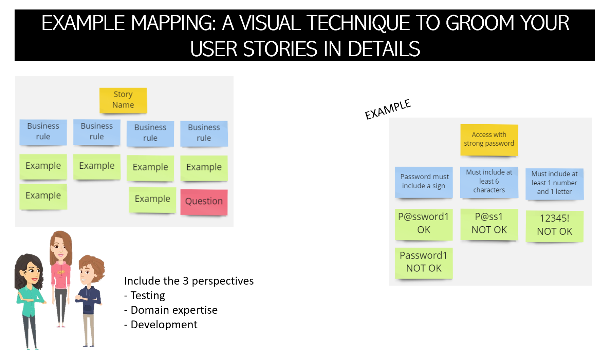

# GildedRose BDD Scaffolding 

This Kata is based on the kata "Gilded Rose Refactoring Kata" posted by 
[Bobby Johnson](https://github.com/NotMyself) on his GitHub account 
[here](https://github.com/NotMyself/GildedRose).

[Philippe](https://github.com/philou), [Matthieu](https://github.com/mattrussa), and I are 
extending this Kata for our talk "**_BDD Scaffolding at the Gilded Rose Inn._**" Our talk focuses 
on applying Behavior Driven Development to deal with legacy code.

## Description

Our PO is asking for a new feature to implement. To do so, we need to modify an untested legacy code. 

_**As you know, that is a risky task with Legacy Code**_!

To ensure we don't break any existing features, we first want to write some feature tests for our current code.

We will do that by following the three steps BDD:
1. **Discovery**: Discuss with Domain Experts to capture rules and scenarios
2. **Formulation**: Write Gherkin Specifications
3. **Automation**: Automate running specifications as tests
 
## Running This Kata 

### Discovery

In this phase, we want to work with a former expert on the subject to understand what the application
is intended to do.

To better understand the application's requirements and behavior, we will use a technique called
[Example Mapping](https://cucumber.io/blog/bdd/example-mapping-introduction/).



### Formulation

In the "Formulation" phase, we want to convert the example mapping stories into Gherkin Specifications.
We can complete this step through developer and QA collaboration.

Once completed, those Gherkin Specifications can act as living documentation and high-level 
description of the features in the system. Along with that, using English or any other spoken 
language, the written features can be read, understood, and written by anyone on the team and 
are not restricted to developers.


Below is an example of a _**Feature**_ for the Standard Item in the Gilded Rose:  
```gherkin
Feature: Gilded Rose Standard Item Quality
  The quality of Standard items degrades by 1 every day until the sellin Date
  After that, they degrade twice as fast.

  Rule: The quality degrades every day
    Scenario Template: The quality of <item> degrades by 1 every day
      Given <item> with quality <initial quality>
      When The quality is updated
      Then <item> should have a quality of <end quality>

      Examples:
        | item            | initial quality | end quality |
        | "Leather Boots" | 10              |9            |
        | "Helmet"        | 7               |6            |

    Scenario: Quality cannot be lower than zero
      Given "Leather Boots" with quality 0
      When The quality is updated
      Then "Leather Boots" should have a quality of 0


  Rule: Quality degrades twice as fast after sellin date
    Scenario: Quality degrades by 1 the day before SellIn date
      Given "Books" with quality 7 and SellIn date in 1 days
      When The quality is updated
      Then "Books" should have a quality of 6

    Scenario: Quality degrades by 2 on the SellIn date
      Given "Books" with quality 7 and SellIn date is today
      When The quality is updated
      Then "Books" should have a quality of 5

```
### Automation 

The third and final step is writing the Java (or another language) code to execute the features!

Once we complete this step, we are confident that there are tests covering the code!

Now, we can refactor and write new features!

Below is a Java code example: 
```java
public class StepDefinitions {
    private Item[] items = new Item[1];
    private GildedRose app;

    @Given("{string} with quality {int}")
    public void with_quality(String itemName, int quality) {
        items[0] = new Item(itemName, 10, quality);
        app = new GildedRose(items);
    }

    @When("The quality is updated")
    public void the_quality_is_updated() {
        app.updateQuality();
    }

    @Then("{string} should have a quality of {int}")
    public void should_have_a_quality_of(String itemName, int expectedQuality) {
        assertEquals(itemName, app.items[0].name);
        assertEquals(expectedQuality, app.items[0].quality);
    }
}
```

## Resources 

